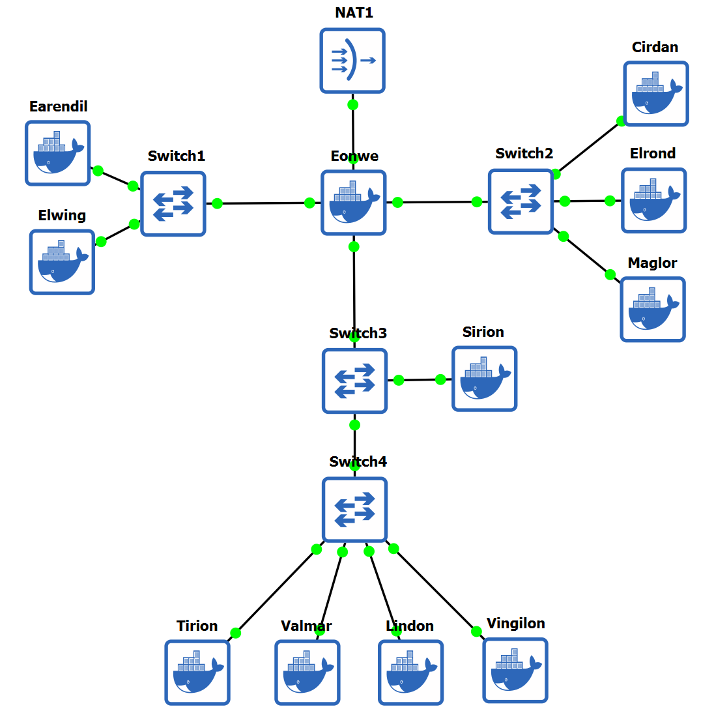

# Modul 2
## Praktikum Komunikasi Data & Jaringan Komputer

## Anggota Kelompok 
| Nama    | NRP  |
|---------|------|
| Imam Mahmud Dalil Fauzan  | 5027241100  |
| Zaenal Mustofa | 5027241018  |

## Write Up
### 1. 
### 2. Konfigurasi NAT di Eonwe
```bash
echo 1 > /proc/sys/net/ipv4/ip_forward
```
### 3. Routing Internal dan Resolver Awal
```bash
echo "nameserver 192.168.122.1" > /etc/resolv.conf
```
### 4. Pada Terminal Tirion:
```Bash
nano /etc/bind/named.conf.options
# isi dengan ini:
options {
    directory "/var/cache/bind";
    listen-on { any; };
    listen-on-v6 { any; };
    allow-query { any; };

    forwarders { 192.168.122.1; }; // forward outward as required
    recursion yes;                 // let clients use ns1 for recursive queries
    dnssec-validation no;          // simplify lab
};
```
```bash
nano /etc/bind/named.conf.local
# isi dengan ini:
zone "K62.com" {
    type master;
    file "/etc/bind/db.K62.com";
    notify yes;                        // send NOTIFY
    also-notify { 192.242.3.21; };     // Valmar (ns2)
    allow-transfer { 192.242.3.21; };  // only Valmar may AXFR/IXFR
};
```
```bash
nano /etc/bind/db.K62.com
# isi dengan ini:
$TTL 3600
@   IN  SOA ns1.K62.com. admin.K62.com. (
        2025101301 ; serial  (YYYYMMDDnn)  <<-- increase on every edit
        3600       ; refresh
        900        ; retry
        604800     ; expire
        300 )      ; minimum

; authoritative nameservers
@       IN  NS  ns1.K62.com.
@       IN  NS  ns2.K62.com.

; glue for nameservers
ns1     IN  A   192.242.3.20    ; Tirion
ns2     IN  A   192.242.3.21    ; Valmar

; apex (front door)
@       IN  A   192.242.3.2    ; Sirion
```

Validasi dan Reload pada Tirion.
```Bash
named-checkconf
named-checkzone K62.com /etc/bind/db.K62.com
systemctl restart bind9 2>/dev/null || service bind9 restart
```

Terminal Valmar:
```Bash
nano /etc/bind/named.conf.options
# isi dengan ini:
options {
    directory "/var/cache/bind";
    listen-on { any; };
    listen-on-v6 { any; };
    allow-query { any; };

    forwarders { 192.168.122.1; };
    recursion yes;
    dnssec-validation no;
};
```
```bash
nano /etc/bind/named.conf.local
# isi dengan ini:
zone "K62.com" {
    type slave;
    masters { 192.242.3.20; };
    file "/var/cache/bind/db.K62.com";
    allow-notify { 192.242.3.20; };
};
```
Run named di Valmar:
```Bash
pkill named 2>/dev/null || true
mkdir -p /var/cache/bind && chown -R bind:bind /var/cache/bind
named -4 -u bind -c /etc/bind/named.conf
```
Cek pada client lain (misal Cirdan):
```Bash
cat >/etc/resolv.conf <<DNS
nameserver 192.242.3.20
nameserver 192.242.3.21
nameserver 192.168.122.1
DNS
```
```Bash
dig K62.com +short
dig ns1.K62.com +short
dig ns2.K62.com +short

ping -c3 K62.com
```

### 5. Membuat Hostname pada tiap Client

Terminal Eonwe:
```Bash
hostnamectl set-hostname eonwe
echo "127.0.1.1 eonwe" >> /etc/hosts
``` 
Terminal Earendil:
```Bash
hostnamectl set-hostname earendil
echo "127.0.1.1 earendil" >> /etc/hosts
```
Terminal Elwing:
```Bash
hostnamectl set-hostname elwing
echo "127.0.1.1 elwing" >> /etc/hosts
```
Terminal Cirdan:
```bash
hostnamectl set-hostname cirdan
echo "127.0.1.1 cirdan" >> /etc/hosts
```
Terminal Elrond:
```bash
hostnamectl set-hostname elrond
echo "127.0.1.1 elrond" >> /etc/hosts
```
Terminal Maglor:
```bash
hostnamectl set-hostname maglor
echo "127.0.1.1 maglor" >> /etc/hosts
```
Terminal Sirion:
```bash
hostnamectl set-hostname sirion
echo "127.0.1.1 sirion" >> /etc/hosts
```
Terminal Tirion:
```bash
hostnamectl set-hostname tirion
echo "127.0.1.1 tirion" >> /etc/hosts
```
Terminal Valmar:
```bash
hostnamectl set-hostname valmar
echo "127.0.1.1 valmar" >> /etc/hosts
```
Terminal Lindon:
```bash
hostnamectl set-hostname lindon
echo "127.0.1.1 lindon" >> /etc/hosts
```
Terminal Vingilot:
```bash
hostnamectl set-hostname vingilot
echo "127.0.1.1 vingilot" >> /etc/hosts
```
Tambahkan Domain ke Zona DNS, di Terminal **Tirion**:
```bash
nano /etc/bind/forward/K62.com

#isi dengan ini:
$TTL    604800
@       IN      SOA     ns1.K62.com. admin.K62.com. (
                              2024101302 ; Serial - dinaikkan
                          604800     ; Refresh
                          86400      ; Retry
                          2419200    ; Expire
                          604800 )   ; Negative Cache TTL
;
@       IN      NS      ns1.K62.com.
@       IN      NS      ns2.K62.com.
@       IN      A       192.242.3.1  ; Sirion (apex domain)

; A Records untuk nameserver
ns1     IN      A       192.242.3.20 ; Tirion
ns2     IN      A       192.242.3.21 ; Valmar

; A Records untuk semua host
eonwe       IN      A       192.242.1.1  ; Asumsi IP Eonwe
earendil    IN      A       192.242.1.2
elwing      IN      A       192.242.1.3
cirdan      IN      A       192.242.2.2
elrond      IN      A       192.242.2.3
maglor      IN      A       192.242.2.4
sirion      IN      A       192.242.3.1
tirion      IN      A       192.242.3.20
valmar      IN      A       192.242.3.21
lindon      IN      A       192.242.3.22
vingilot    IN      A       192.242.3.23
```
Restart BIND9 di Tirion:
```bash
service bind9 restart
# ATAU
systemctl restart bind9
```
Verifikasi Hostname dan DNS, Test di setiap client:
```bash
hostname
nslookup earendil.K62.com
nslookup elwing.K62.com
nslookup sirion.K62.com
```
Pastikan Valmar tersinkron:
```bash
nslookup K62.com localhost
nslookup earendil.K62.com localhost
```
### 8. Reverse DNS Zone untuk DMZ
Di Terminal Tirion:
```bash
nano /etc/bind/named.conf.local
#isi dengan ini:
zone "K62.com" {
    type master;
    file "/etc/bind/forward/K62.com";
    allow-transfer { 192.242.3.21; };
    also-notify { 192.242.3.21; };
};

// Tambahkan reverse zone untuk 192.242.3.0/24
zone "3.242.192.in-addr.arpa" {
    type master;
    file "/etc/bind/reverse/3.242.192.in-addr.arpa";
    allow-transfer { 192.242.3.21; };
    also-notify { 192.242.3.21; };
};
```
```bash
mkdir -p /etc/bind/reverse
nano /etc/bind/reverse/3.242.192.in-addr.arpa

#isi dengan ini:
$TTL    604800
@       IN      SOA     ns1.K62.com. admin.K62.com. (
                              2024101301 ; Serial
                          604800     ; Refresh
                          86400      ; Retry
                          2419200    ; Expire
                          604800 )   ; Negative Cache TTL
;
@       IN      NS      ns1.K62.com.
@       IN      NS      ns2.K62.com.

; PTR Records untuk DMZ segment
1       IN      PTR     sirion.K62.com.
22      IN      PTR     lindon.K62.com.
23      IN      PTR     vingilot.K62.com.
20      IN      PTR     tirion.K62.com.
21      IN      PTR     valmar.K62.com.
```
Konfigurasi Reverse Zone, di Terminal Valmar (ns2):
```bash
nano /etc/bind/named.conf.local

#isi dengan ini:
zone "K62.com" {
    type slave;
    file "/var/cache/bind/K62.com";
    masters { 192.242.3.20; };
};

zone "3.242.192.in-addr.arpa" {
    type slave;
    file "/var/cache/bind/3.242.192.in-addr.arpa";
    masters { 192.242.3.20; };
};
```
Restart BIND9 di kedua server (Tirion dan Valmar):
```bash
systemctl restart bind9
```
Verifikasi Reverse DNS, Test dari client mana saja:
```bash
# Test dengan specify nameserver
nslookup 192.242.3.1 192.242.3.20
nslookup 192.242.3.22 192.242.3.21

#Expected Output:
1.3.242.192.in-addr.arpa    name = sirion.K62.com.
22.3.242.192.in-addr.arpa   name = lindon.K62.com.
23.3.242.192.in-addr.arpa   name = vingilot.K62.com.
```

### 9. Web Static di Lindon dengan Autoindex
Di Terminal Lindon, Install `nginx` dan Buat direktori untuk web static:
```bash
mkdir -p /var/www/static/annals

# Buat beberapa file contoh
echo "<h1>Annals of Beleriand - File 1</h1>" > /var/www/static/annals/file1.html
echo "<h1>Annals of Beleriand - File 2</h1>" > /var/www/static/annals/file2.html
echo "<h1>Annals of Beleriand - File 3</h1>" > /var/www/static/annals/file3.html
mkdir -p /var/www/static/annals/subfolder
echo "<h1>Subfolder File</h1>" > /var/www/static/annals/subfolder/test.html
```
Buat Konfigurasi `nginx`:
```bash
nano /etc/nginx/sites-available/static

#isi dengan ini:
server {
    listen 80;
    server_name static.K62.com lindon.K62.com;
    
    root /var/www/static;
    index index.html index.htm;
    
    # Autoindex untuk folder /annals
    location /annals/ {
        autoindex on;
    }
    
    # Halaman utama
    location / {
        try_files $uri $uri/ =404;
    }
}
```
Aktifkan Konfigurasi:
```bash
ln -s /etc/nginx/sites-available/static /etc/nginx/sites-enabled/
rm -f /etc/nginx/sites-enabled/default

#Test konfigurasi dan Restart
nginx -t
service nginx restart
service nginx start
```
Verifikasi Web Static, Dari client (Earendil/Elrond):
```bash
# Test dengan curl
curl http://static.K62.com/annals/

# Test dengan browser text-based
lynx http://static.K62.com/annals/

#Expected: Bisa melihat directory listing dari folder /annals
```
### 10. Web Dinamis di Vingilot dengan PHP-FPM
Di Terminal Vingilot, Install Packages:
```bash
apt install nginx php8.4-fpm php8.4-cli -y

# Buat direktori web
mkdir -p /var/www/app
```
Buat file PHP untuk beranda nano:
```bash
nano /var/www/app/index.php

#isi dengan ini:
<!DOCTYPE html>
<html>
<head>
    <title>Vingilot - Web Dinamis</title>
</head>
<body>
    <h1>Selamat Datang di Vingilot</h1>
    <p>Ini adalah halaman beranda dinamis</p>
    <p>Server time: <?php echo date('Y-m-d H:i:s'); ?></p>
    <p>PHP Version: <?php echo phpversion(); ?></p>
    <nav>
        <a href="/">Home</a> | 
        <a href="/about">About</a>
    </nav>
</body>
</html>
```
Buat file PHP untuk about:
```bash
nano /var/www/app/about.php

#isi dengan ini:
<!DOCTYPE html>
<html>
<head>
    <title>About - Vingilot</title>
</head>
<body>
    <h1>Tentang Vingilot</h1>
    <p>Ini adalah halaman about yang diakses tanpa ekstensi .php</p>
    <p>Powered by PHP <?php echo phpversion(); ?></p>
    <nav>
        <a href="/">Home</a> | 
        <a href="/about">About</a>
    </nav>
</body>
</html>
```
Buat konfigurasi Nginx:
```bash
nano /etc/nginx/sites-available/app

#isi dengan ini:
server {
    listen 80;
    server_name app.K62.com vingilot.K62.com;
    
    root /var/www/app;
    index index.php index.html index.htm;
    
    location / {
        try_files $uri $uri/ =404;
    }
    
    # Rewrite untuk /about tanpa .php
    location = /about {
        rewrite ^ /about.php last;
    }
    
    # PHP-FPM configuration
    location ~ \.php$ {
        include snippets/fastcgi-php.conf;
        fastcgi_pass unix:/var/run/php/php8.4-fpm.sock;
        fastcgi_param SCRIPT_FILENAME $document_root$fastcgi_script_name;
        include fastcgi_params;
    }
    
    # Deny access to .htaccess files
    location ~ /\.ht {
        deny all;
    }
}
```
Konfigurasi PHP-FPM dan Aktifkan:
```bash
# Edit pool configuration jika diperlukan
nano /etc/php/8.4/fpm/pool.d/www.conf
# Pastikan listen = /var/run/php/php8.4-fpm.sock

ln -s /etc/nginx/sites-available/app /etc/nginx/sites-enabled/
rm -f /etc/nginx/sites-enabled/default
```
Set permission kemudian Aktifkan:
```bash
chown -R www-data:www-data /var/www/app
chmod -R 755 /var/www/app

nginx -t  
service nginx restart
service php8.4-fpm restart
service nginx enable php8.4-fpm
```
Verifikasi Web Dinamis, Dari client (Earendil/Elrond):
```bash
# Test halaman beranda
curl http://app.K62.com/
# Test halaman about (tanpa .php)
curl http://app.K62.com/about
# Test dengan PHP info (opsional)
curl http://app.K62.com/index.php

# Expected Output:
# / → Menampilkan halaman beranda dengan timestamp
# /about → Menampilkan halaman about tanpa perlu mengetik .php
# Semua akses menggunakan hostname app.K62.com
```
### 11. Di Terminal Sirion
```bash
apt install nginx -y
nano /etc/nginx/sites-available/reverse_proxy
# masukkan ini:

server {
    listen 80;
    server_name www.K62.com sirion.K62.com;
    location /static/ {
        proxy_pass http://192.242.3.22/;
        proxy_set_header Host $host;
        proxy_set_header X-Real-IP $remote_addr;
        proxy_set_header X-Forwarded-For $proxy_add_x_forwarded_for;
        proxy_set_header X-Forwarded-Proto $scheme;
    }
    location /app/ {
        proxy_pass http://192.242.3.23/;
        proxy_set_header Host $host;
        proxy_set_header X-Real-IP $remote_addr;
        proxy_set_header X-Forwarded-For $proxy_add_x_forwarded_for;
        proxy_set_header X-Forwarded-Proto $scheme;
    }
}
```
```bash
ln -s /etc/nginx/sites-available/reverse_proxy /etc/nginx/sites-enabled/
rm /etc/nginx/sites-enabled/default

nginx -t
service nginx restart
```
Test di terminal Lain (Elrond):
```bash
curl http://www.K62.com/static/annals/
curl http://www.K62.com/app/
```

### 12. Buka di Terminal Sirion:
```bash
apt install apache2-utils -y
htpasswd -c /etc/nginx/.htpasswd admin

nano /etc/nginx/sites-available/reverse_proxy
# masukkan ini:
server {
    listen 80;
    server_name www.K62.com sirion.K62.com;
    location /admin {
        auth_basic "Restricted Content";
        auth_basic_user_file /etc/nginx/.htpasswd;
        proxy_pass http://192.242.3.23/;
        proxy_set_header Host $host;
        proxy_set_header X-Real-IP $remote_addr;
        proxy_set_header X-Forwarded-For $proxy_add_x_forwarded_for;
        proxy_set_header X-Forwarded-Proto $scheme;
    }
    location /static/ {
        proxy_pass http://192.242.3.22/;
        proxy_set_header Host $host;
        proxy_set_header X-Real-IP $remote_addr;
        proxy_set_header X-Forwarded-For $proxy_add_x_forwarded_for;
        proxy_set_header X-Forwarded-Proto $scheme;
    }
    location /app/ {
        proxy_pass http://192.242.3.23/;
        proxy_set_header Host $host;
        proxy_set_header X-Real-IP $remote_addr;
        proxy_set_header X-Forwarded-For $proxy_add_x_forwarded_for;
        proxy_set_header X-Forwarded-Proto $scheme;
    }
}
```
```bash
nginx -t
service nginx restart
```
Buka Terminal Elrond:
```bash
curl -I http://www.K62.com/admin
curl -I --user admin:adpiajd http://www.K62.com/admin
curl -I --user admin:admin http://www.K62.com/admin
```

### 13. Buka Terminal Sirion:
```bash
nano /etc/nginx/sites-available/reverse_proxy 
# masukkan ini:
server {
    listen 80 default_server;
    server_name sirion.K62.com;
    return 301 http://www.K62.com$request_uri;
}

server {
    listen 80;
    server_name www.K62.com;
    location /admin {
        auth_basic "Restricted Content";
        auth_basic_user_file /etc/nginx/.htpasswd;
        proxy_pass http://192.242.3.23/;
        proxy_set_header Host $host;
        proxy_set_header X-Real-IP $remote_addr;
        proxy_set_header X-Forwarded-For $proxy_add_x_forwarded_for;
        proxy_set_header X-Forwarded-Proto $scheme;
    }

    location /static/ {
        proxy_pass http://192.242.3.22/;
        proxy_set_header Host $host;
        proxy_set_header X-Real-IP $remote_addr;
        proxy_set_header X-Forwarded-For $proxy_add_x_forwarded_for;
        proxy_set_header X-Forwarded-Proto $scheme;
    }

    location /app/ {
        proxy_pass http://192.242.3.23/;
        proxy_set_header Host $host;
        proxy_set_header X-Real-IP $remote_addr;
        proxy_set_header X-Forwarded-For $proxy_add_x_forwarded_for;
        proxy_set_header X-Forwarded-Proto $scheme;
    }
}
```
```bash
nginx -t
service nginx restart
```
Buka Terminal Elrond:
```bash
curl -I http://192.242.3.2/app/
curl -I http://sirion.K62.com/static/
curl -I http://www.K62.com/app/
```

### 14. Buka Terminal Vingilot
```bash
nano /etc/apache2/apache2.conf
# masukkan ini dibawah logformat lainnya:
LogFormat "%{X-Forwarded-For}i %l %u %t \"%r\" %>s %O \"%{Referer}i\" \"%{User-Agent}i\"" proxy

# ubah ini:
CustomLog ${APACHE_LOG_DIR}/app_K62_access.log combined
# menjadi:
CustomLog ${APACHE_LOG_DIR}/app_K62_access.log proxy
```
```bash
service apache2 restart
```
Buka Terminal Elrond:
```bash
curl http://www.K62.com/app/
```
Buka Terminal Vingilot:
```bash
tail -n 5 /var/log/apache2/app_K62_access.log
```

### 15. Buka Terminal Elrond:
```bash
apt install apache2-utils -y
ab -n 500 -c 10 http://www.K62.com/app/
ab -n 500 -c 10 http://www.K62.com/static/
```

### 16. Buka Terminal Elrond:
```bash
dig static.K62.com +short
```
Buka Terminal Tirion:
```bash
nano /etc/bind/jarkom/db.K62.com
# masukkan ini:
$TTL    604800
@       IN      SOA     ns1.K62.com. root.K62.com. (
                              3         ; Serial
                         604800         ; Refresh
                          86400         ; Retry
                        2419200         ; Expire
                         604800 )       ; Negative Cache TTL
;
@       IN      NS      ns1.K62.com.
@       IN      NS      ns2.K62.com.

K62.com.        IN      A       192.242.3.1
ns1             IN      A       192.242.3.20
ns2             IN      A       192.242.3.21
sirion          IN      A       192.242.3.1
lindon      30  IN      A       192.242.3.22
vingilot        IN      A       192.242.3.23

www             IN      CNAME   sirion.K62.com.
static      30  IN      CNAME   lindon.K62.com.
app             IN      CNAME   vingilot.K62.com.
```
```bash
service named restart
```
Buka Terminal Valmar:
```bash
dig K62.com @localhost SOA
```
Buka Terminal Elrond:
```bash
dig static.K62.com +short
# tunggu 40 detik - 1 menit
dig static.K62.com +short
```